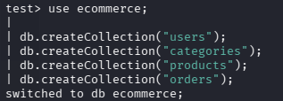
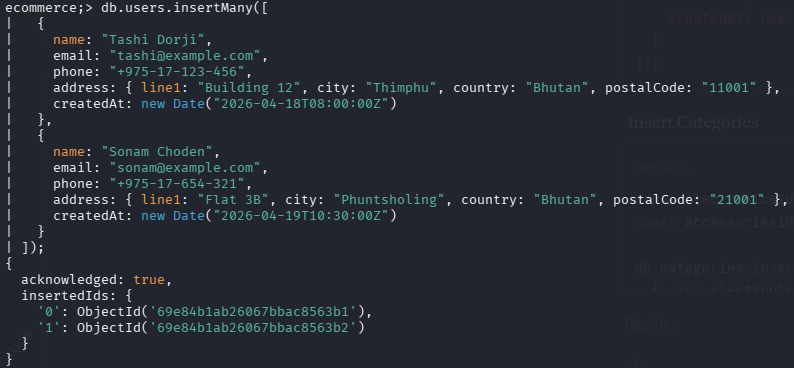
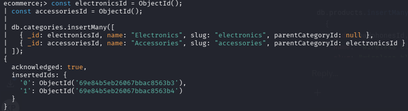
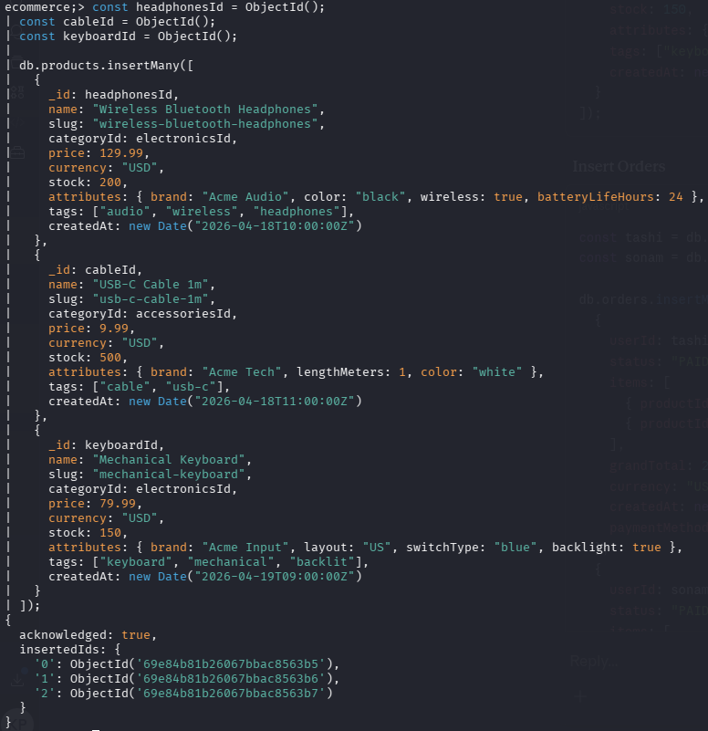
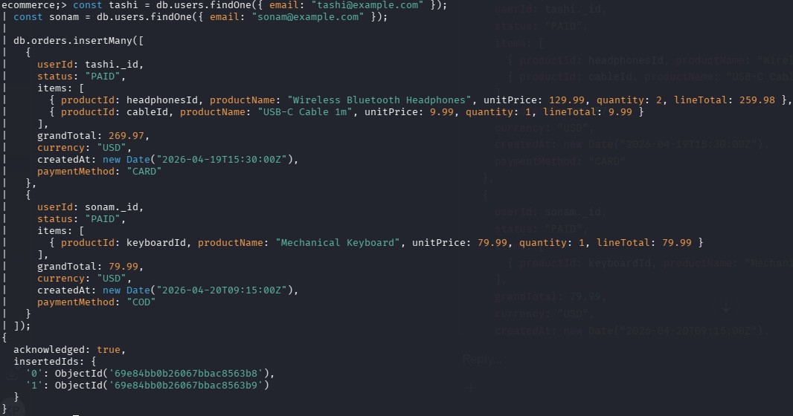

# DBS302_Practical3_Report

---

**Module:** DBS302 - No SQL Database Management
**Practical:** Practical 3
**Topic:** E-Commerce Platform Schema Design, Aggregation Framework, and Query Optimization
**Unit:** Unit III - MongoDB

---

## Table of Contents

1. [Introduction](about:blank#1-introduction)
2. [Schema Design and Justification](about:blank#2-schema-design-and-justification)
3. [Implementation - Collections and Sample Data](about:blank#3-implementation--collections-and-sample-data)
4. [Aggregation Framework - Analytics Queries](about:blank#4-aggregation-framework--analytics-queries)
5. [Index Creation and Query Optimization](about:blank#5-index-creation-and-query-optimization)
6. [Query Plan Analysis - explain()](about:blank#6-query-plan-analysis--explain)
7. [Reflection](about:blank#7-reflection)
8. [References](about:blank#8-references)

---

## 1. Introduction

This practical explores the design and implementation of a MongoDB-based schema for a simplified e-commerce platform. The aim is to demonstrate proficiency in MongoDB’s document-oriented data modelling principles, the aggregation framework, and query performance optimization through indexing and plan analysis.

Unlike relational databases, MongoDB organises data as flexible BSON documents within collections, allowing schema design to be driven primarily by application access patterns rather than normalization rules. This “query-first” approach is central to achieving performance and scalability in document databases.

The platform modelled in this practical supports four primary operations:

- Managing users and a product catalog with variable attributes
- Recording customer orders with embedded line items
- Running analytical queries such as daily sales totals, top products by revenue, and per-customer spending statistics
- Optimizing those queries through indexing and `explain()` analysis

The following sections document the schema design rationale, the implementation process, the aggregation pipelines constructed, and the performance improvements demonstrated through indexing.

---

## 2. Schema Design and Justification

### 2.1 Design Philosophy

MongoDB’s data modelling philosophy encourages designing schemas around how data is accessed, not around avoiding redundancy. Two key decisions arise repeatedly: whether to **embed** related data inside a document, or to **reference** it via an identifier pointing to another collection.

The guiding principle applied in this practical is:

> _Embed when data is always accessed together and bounded in size. Reference when data is shared, reused, or could grow without bound._

### 2.2 Collections Overview

The schema consists of four collections:

| Collection   | Purpose                                             |
| ------------ | --------------------------------------------------- |
| `users`      | Stores customer profiles and address information    |
| `categories` | Stores product category hierarchy                   |
| `products`   | Stores the product catalog with variable attributes |
| `orders`     | Stores customer orders with embedded line items     |

### 2.3 Embedding vs. Referencing Decisions

### Order Items: Embedded

Order items (the individual products within an order) are **embedded** directly inside each order document as an array. This decision is justified for the following reasons:

- Order items are always read together with their parent order - there is no use case where only the items are retrieved without the order.
- The number of items per order is bounded and small in practice, avoiding the risk of unbounded document growth.
- Embedding avoids the need for a join operation (`$lookup`) on every order retrieval, which significantly reduces read latency at scale.
- Historical accuracy is preserved: product names and prices at the time of purchase are stored within the order. Even if the product’s price changes later, the order record remains correct.

### Products: Referenced from Orders

Rather than duplicating full product documents inside every order, orders store only the `productId` as a reference to the `products` collection. This is appropriate because:

- Products are shared entities referenced by many orders. Full embedding would create massive and inconsistent redundancy.
- Product details (stock levels, descriptions, images) can change independently without affecting historical order data, since the relevant snapshot fields (name, unit price) are already embedded.
- References allow joining via `$lookup` when full product details are needed for reporting.

### Categories: Referenced from Products

Categories are stored in a separate collection and referenced from `products` via `categoryId`. This is appropriate because:

- Multiple products share the same category, making embedding wasteful and difficult to update consistently.
- Category hierarchies (parent-child relationships) are more naturally modelled as separate documents.

### 2.4 Attribute Pattern for Products

Product catalogs in e-commerce are inherently heterogeneous, a laptop has different attributes (RAM, processor) than a shirt (size, material). MongoDB’s flexible schema accommodates this naturally.

The **Attribute Pattern** is applied by storing product-specific attributes in a nested `attributes` object with key-value pairs. This avoids creating sparse, mostly-null columns (as would be required in a relational schema) and allows new attribute types to be added per product without a schema migration.

```json
"attributes": {
  "brand": "Acme Audio",
  "color": "black",
  "wireless": true,
  "batteryLifeHours": 24
}
```

---

## 3. Implementation: Collections and Sample Data

### 3.1 Database and Collection Creation

The `ecommerce` database and its four collections were created using `mongosh`:

```jsx
use ecommerce;

db.createCollection("users");
db.createCollection("categories");
db.createCollection("products");
db.createCollection("orders");
```



### 3.2 Users Collection

Two user documents were inserted to represent customers:

```jsx
db.users.insertMany([
  {
    name: "Tashi Dorji",
    email: "tashi@example.com",
    phone: "+975-17-123-456",
    address: {
      line1: "Building 12",
      city: "Thimphu",
      country: "Bhutan",
      postalCode: "11001",
    },
    createdAt: new Date("2026-04-18T08:00:00Z"),
  },
  {
    name: "Sonam Choden",
    email: "sonam@example.com",
    phone: "+975-17-654-321",
    address: {
      line1: "Flat 3B",
      city: "Phuntsholing",
      country: "Bhutan",
      postalCode: "21001",
    },
    createdAt: new Date("2026-04-19T10:30:00Z"),
  },
]);
```



### 3.3 Categories Collection

```jsx
const electronicsId = ObjectId();
const accessoriesId = ObjectId();

db.categories.insertMany([
  {
    _id: electronicsId,
    name: "Electronics",
    slug: "electronics",
    parentCategoryId: null,
  },
  {
    _id: accessoriesId,
    name: "Accessories",
    slug: "accessories",
    parentCategoryId: electronicsId,
  },
]);
```



### 3.4 Products Collection

Three product documents were inserted using the Attribute Pattern for variable specifications:

```jsx
db.products.insertMany([
  {
    _id: headphonesId,
    name: "Wireless Bluetooth Headphones",
    categoryId: electronicsId,
    price: 129.99,
    currency: "USD",
    stock: 200,
    attributes: {
      brand: "Acme Audio",
      color: "black",
      wireless: true,
      batteryLifeHours: 24,
    },
    tags: ["audio", "wireless", "headphones"],
    createdAt: new Date("2026-04-18T10:00:00Z"),
  },
  // ... (USB-C Cable and Mechanical Keyboard)
]);
```



### 3.5 Orders Collection

Two orders were inserted with embedded items:

```jsx
db.orders.insertMany([
  {
    userId: tashi._id,
    status: "PAID",
    items: [
      {
        productId: headphonesId,
        productName: "Wireless Bluetooth Headphones",
        unitPrice: 129.99,
        quantity: 2,
        lineTotal: 259.98,
      },
      {
        productId: cableId,
        productName: "USB-C Cable 1m",
        unitPrice: 9.99,
        quantity: 1,
        lineTotal: 9.99,
      },
    ],
    grandTotal: 269.97,
    currency: "USD",
    createdAt: new Date("2026-04-19T15:30:00Z"),
    paymentMethod: "CARD",
  },
  // ... (Sonam's order)
]);
```



---

## 4. Aggregation Framework: Analytics Queries

MongoDB’s aggregation framework processes documents through a sequence of pipeline stages, where the output of each stage becomes the input of the next. This section presents four analytical queries demonstrating key pipeline operators.

### 4.1 Query 1- Daily Sales Totals

**Objective:** Calculate total revenue and order count per day for all completed (PAID) orders.

**Pipeline stages used:** `$match`, `$group`, `$project`, `$sort`

```jsx
db.orders.aggregate([
  { $match: { status: "PAID" } },
  {
    $group: {
      _id: {
        year: { $year: "$createdAt" },
        month: { $month: "$createdAt" },
        day: { $dayOfMonth: "$createdAt" },
      },
      totalRevenue: { $sum: "$grandTotal" },
      orderCount: { $sum: 1 },
    },
  },
  {
    $project: {
      _id: 0,
      date: {
        $dateFromParts: {
          year: "$_id.year",
          month: "$_id.month",
          day: "$_id.day",
        },
      },
      totalRevenue: 1,
      orderCount: 1,
    },
  },
  { $sort: { date: 1 } },
]);
```

**Explanation:** The `$match` stage filters only paid orders before any grouping occurs, reducing the number of documents processed by downstream stages. The `$group` stage extracts the date components from `createdAt` and computes the sum and count per day. The `$project` stage reconstructs the date as an ISO date object and suppresses the `_id` field for cleaner output.

**Expected Output:**


---

### 4.2 Query 2 - Top 5 Products by Revenue

**Objective:** Identify the five highest-earning products across all paid orders.

**Pipeline stages used:** `$match`, `$unwind`, `$group`, `$sort`, `$limit`

```jsx
db.orders.aggregate([
  { $match: { status: "PAID" } },
  { $unwind: "$items" },
  {
    $group: {
      _id: "$items.productId",
      productName: { $first: "$items.productName" },
      totalRevenue: { $sum: "$items.lineTotal" },
      totalQuantity: { $sum: "$items.quantity" },
    },
  },
  { $sort: { totalRevenue: -1 } },
  { $limit: 5 },
]);
```

**Explanation:** The `$unwind` stage deconstructs the embedded `items` array, producing one document per line item. This allows the `$group` stage to aggregate across all order items by `productId`. The `$first` accumulator captures the product name from the first encountered document for that product. The pipeline ends with a descending sort on revenue and a `$limit` of 5.


---

### 4.3 Query 3 - Average Order Value per Customer

**Objective:** Compute spending statistics per customer and enrich the results with user names via a join.

**Pipeline stages used:** `$match`, `$group`, `$lookup`, `$unwind`, `$project`, `$sort`

```jsx
db.orders.aggregate([
  { $match: { status: "PAID" } },
  {
    $group: {
      _id: "$userId",
      totalOrders: { $sum: 1 },
      totalSpent: { $sum: "$grandTotal" },
      avgOrderValue: { $avg: "$grandTotal" },
      minOrderValue: { $min: "$grandTotal" },
      maxOrderValue: { $max: "$grandTotal" },
    },
  },
  {
    $lookup: {
      from: "users",
      localField: "_id",
      foreignField: "_id",
      as: "user",
    },
  },
  { $unwind: "$user" },
  {
    $project: {
      _id: 0,
      userName: "$user.name",
      totalOrders: 1,
      totalSpent: 1,
      avgOrderValue: 1,
    },
  },
  { $sort: { totalSpent: -1 } },
]);
```

**Explanation:** After grouping by `userId`, the `$lookup` stage performs a left outer join with the `users` collection to enrich results with customer names. This demonstrates how MongoDB can bridge between referenced collections within a single pipeline without a separate query. The `$unwind` after `$lookup` is necessary because `$lookup` returns an array; unwinding extracts the single matching user document.


---

### 4.4 Query 4 - Product Catalog with Category Names

**Objective:** Display the product catalog enriched with human-readable category names.

**Pipeline stages used:** `$lookup`, `$unwind`, `$project`, `$sort`

```jsx
db.products.aggregate([
  {
    $lookup: {
      from: "categories",
      localField: "categoryId",
      foreignField: "_id",
      as: "category",
    },
  },
  { $unwind: "$category" },
  {
    $project: {
      _id: 0,
      name: 1,
      price: 1,
      "attributes.brand": 1,
      "attributes.color": 1,
      categoryName: "$category.name",
    },
  },
  { $sort: { categoryName: 1, name: 1 } },
]);
```

**Explanation:** This pipeline joins the `products` collection with `categories` using the stored `categoryId` reference. The `$project` stage uses dot notation to selectively expose nested attribute fields and renames the joined category name using a field expression.


---

## 5. Index Creation and Query Optimization

### 5.1 Purpose of Indexing

Without indexes, MongoDB must perform a **collection scan (COLLSCAN)** - examining every document in a collection to satisfy a query. For large collections, this is prohibitively slow. Indexes are data structures that allow MongoDB to locate relevant documents directly, analogous to an index in a textbook.

The indexes created in this practical are aligned with the four most common query patterns identified during schema design.

### 5.2 Index 1 - Orders by User and Date

**Query pattern:** Fetch a user’s orders, sorted by most recent first.

```jsx
db.orders.createIndex(
  { userId: 1, createdAt: -1 },
  { name: "idx_orders_user_createdAt" },
);
```

This compound index supports queries such as:

```jsx
db.orders.find({ userId: <id> }).sort({ createdAt: -1 });
```

The ascending `userId` field handles the equality filter efficiently, while the descending `createdAt` field aligns with the sort direction, avoiding an in-memory sort operation.

### 5.3 Index 2 - Orders by Status and Date (ESR Pattern)

**Query pattern:** Filter orders by payment status within a date range.

```jsx
db.orders.createIndex(
  { status: 1, createdAt: -1 },
  { name: "idx_orders_status_createdAt" },
);
```

This index applies the **ESR (Equality → Sort → Range)** compound index design pattern. The equality field (`status`) is placed first, followed by the sort field (`createdAt`). This ordering maximises index utilization by narrowing the candidate documents through the equality filter before applying the sort.

### 5.4 Index 3 - Products by Category and Price

**Query pattern:** List products within a category, sorted by price.

```jsx
db.products.createIndex(
  { categoryId: 1, price: 1 },
  { name: "idx_products_category_price" },
);
```

This supports filtered catalog browsing queries such as:

```jsx
db.products.find({ categoryId: electronicsId }).sort({ price: 1 });
```

### 5.5 Index 4 - Text Search on Products

**Query pattern:** Full-text keyword search across product names and tags.

```jsx
db.products.createIndex(
  { name: "text", tags: "text" },
  {
    name: "idx_products_text",
    weights: { name: 10, tags: 5 },
  },
);
```

The `weights` option assigns higher relevance scores to matches in the `name` field than in `tags`, allowing results to be ranked by relevance:

```jsx
db.products
  .find(
    { $text: { $search: "wireless keyboard" } },
    { score: { $meta: "textScore" }, name: 1, price: 1 },
  )
  .sort({ score: { $meta: "textScore" } });
```

### 5.6 Verifying Indexes

All created indexes were verified using:

```jsx
db.orders.getIndexes();
db.products.getIndexes();
```


---

## 6. Query Plan Analysis - explain()

### 6.1 Purpose

MongoDB’s `explain("executionStats")` method exposes the query execution plan and runtime statistics. The key fields to inspect are:

| Field                 | Meaning                                                    |
| --------------------- | ---------------------------------------------------------- |
| `winningPlan.stage`   | `COLLSCAN` (no index, slow) or `IXSCAN` (uses index, fast) |
| `totalDocsExamined`   | Number of documents read from disk                         |
| `totalKeysExamined`   | Number of index entries scanned                            |
| `executionTimeMillis` | Total query execution time in milliseconds                 |

A well-optimized query minimizes `totalDocsExamined` and avoids `COLLSCAN`.

### 6.2 Test Query

The following query was used to demonstrate the before-and-after impact of indexing:

```jsx
db.orders
  .find({ status: "PAID", createdAt: { $gte: new Date("2026-04-19") } })
  .sort({ createdAt: -1 })
  .explain("executionStats");
```

### 6.3 Before Indexing - COLLSCAN

The index `idx_orders_status_createdAt` was first dropped to simulate the absence of a supporting index:

```jsx
db.orders.dropIndex("idx_orders_status_createdAt");
```

Running `explain()` without the index produced the following plan characteristics:

- `winningPlan.stage`: **COLLSCAN**
- `totalDocsExamined`: equal to total documents in collection
- `executionTimeMillis`: higher due to full scan

**Expected Output:**

```bash
ecommerce;> db.orders.dropIndex("idx_orders_status_createdAt");
|
| db.orders.find(
|   { status: "PAID", createdAt: { $gte: new Date("2026-04-19") } }
| ).sort({ createdAt: -1 }).explain("executionStats");
{
  explainVersion: '1',
  queryPlanner: {
    namespace: 'ecommerce;.orders',
    parsedQuery: {
      '$and': [
        { status: { '$eq': 'PAID' } },
        { createdAt: { '$gte': ISODate('2026-04-19T00:00:00.000Z') } }
      ]
    },
    indexFilterSet: false,
    queryHash: 'B64DBFE5',
    planCacheShapeHash: 'B64DBFE5',
    planCacheKey: '823870A8',
    optimizationTimeMillis: 0,
    maxIndexedOrSolutionsReached: false,
    maxIndexedAndSolutionsReached: false,
    maxScansToExplodeReached: false,
    prunedSimilarIndexes: false,
    winningPlan: {
      isCached: false,
      stage: 'SORT',
      sortPattern: { createdAt: -1 },
      memLimit: 104857600,
      type: 'simple',
      inputStage: {
        stage: 'COLLSCAN',
        filter: {
          '$and': [
            { status: { '$eq': 'PAID' } },
            {
              createdAt: { '$gte': ISODate('2026-04-19T00:00:00.000Z') }
            }
          ]
        },
        direction: 'forward'
      }
    },
    rejectedPlans: []
  },
  executionStats: {
    executionSuccess: true,
    nReturned: 2,
    executionTimeMillis: 0,
    totalKeysExamined: 0,
    totalDocsExamined: 2,
    executionStages: {
      isCached: false,
      stage: 'SORT',
      nReturned: 2,
      executionTimeMillisEstimate: 0,
      works: 6,
      advanced: 2,
      needTime: 3,
      needYield: 0,
      saveState: 0,
      restoreState: 0,
      isEOF: 1,
      sortPattern: { createdAt: -1 },
      memLimit: 104857600,
      type: 'simple',
      totalDataSizeSorted: 732,
      usedDisk: false,
      spills: 0,
      spilledRecords: 0,
      spilledBytes: 0,
      spilledDataStorageSize: 0,
      inputStage: {
        stage: 'COLLSCAN',
        filter: {
          '$and': [
            { status: { '$eq': 'PAID' } },
            {
              createdAt: { '$gte': ISODate('2026-04-19T00:00:00.000Z') }
            }
          ]
        },
        nReturned: 2,
        executionTimeMillisEstimate: 0,
        works: 3,
        advanced: 2,
        needTime: 0,
        needYield: 0,
        saveState: 0,
        restoreState: 0,
        isEOF: 1,
        direction: 'forward',
        docsExamined: 2
      }
    }
  },
  queryShapeHash: 'C6FDB71A910BB6E40CA7636E5804F8D715BC92FAA461FE0BC1E099280FD91C95',
  command: {
    find: 'orders',
    filter: {
      status: 'PAID',
      createdAt: { '$gte': ISODate('2026-04-19T00:00:00.000Z') }
    },
    sort: { createdAt: -1 },
    '$db': 'ecommerce;'
  },
  serverInfo: {
    host: 'kp',
    port: 27017,
    version: '8.2.7',
    gitVersion: '8f6785264a643d2eeb5e4046f7876a23e40e1a09'
  },
  serverParameters: {
    internalQueryFacetBufferSizeBytes: 104857600,
    internalQueryFacetMaxOutputDocSizeBytes: 104857600,
    internalLookupStageIntermediateDocumentMaxSizeBytes: 104857600,
    internalDocumentSourceGroupMaxMemoryBytes: 104857600,
    internalQueryMaxBlockingSortMemoryUsageBytes: 104857600,
    internalQueryProhibitBlockingMergeOnMongoS: 0,
    internalQueryMaxAddToSetBytes: 104857600,
    internalDocumentSourceSetWindowFieldsMaxMemoryBytes: 104857600,
    internalQueryFrameworkControl: 'trySbeRestricted',
    internalQueryPlannerIgnoreIndexWithCollationForRegex: 1
  },
  ok: 1
}
```

### 6.4 After Indexing - IXSCAN

The index was recreated:

```jsx
db.orders.createIndex(
  { status: 1, createdAt: -1 },
  { name: "idx_orders_status_createdAt" },
);
```

Re-running `explain()` after index creation produced:

- `winningPlan.stage`: **IXSCAN**
- `totalDocsExamined`: significantly reduced
- `executionTimeMillis`: improved

**Expected Output:**

```bash
ecommerce;> db.orders.createIndex({ status: 1, createdAt: -1 }, { name: "idx_orders_status_createdAt" });
idx_orders_status_createdAt
ecommerce;> db.orders.find(
|   { status: "PAID", createdAt: { $gte: new Date("2026-04-19") } }
| ).sort({ createdAt: -1 }).explain("executionStats");
{
  explainVersion: '1',
  queryPlanner: {
    namespace: 'ecommerce;.orders',
    parsedQuery: {
      '$and': [
        { status: { '$eq': 'PAID' } },
        { createdAt: { '$gte': ISODate('2026-04-19T00:00:00.000Z') } }
      ]
    },
    indexFilterSet: false,
    queryHash: 'B64DBFE5',
    planCacheShapeHash: 'B64DBFE5',
    planCacheKey: '4A49B954',
    optimizationTimeMillis: 0,
    maxIndexedOrSolutionsReached: false,
    maxIndexedAndSolutionsReached: false,
    maxScansToExplodeReached: false,
    prunedSimilarIndexes: false,
    winningPlan: {
      isCached: false,
      stage: 'FETCH',
      inputStage: {
        stage: 'IXSCAN',
        keyPattern: { status: 1, createdAt: -1 },
        indexName: 'idx_orders_status_createdAt',
        isMultiKey: false,
        multiKeyPaths: { status: [], createdAt: [] },
        isUnique: false,
        isSparse: false,
        isPartial: false,
        indexVersion: 2,
        direction: 'forward',
        indexBounds: {
          status: [ '["PAID", "PAID"]' ],
          createdAt: [
            '[new Date(9223372036854775807), new Date(1776556800000)]'
          ]
        }
      }
    },
    rejectedPlans: []
  },
  executionStats: {
    executionSuccess: true,
    nReturned: 2,
    executionTimeMillis: 1,
    totalKeysExamined: 2,
    totalDocsExamined: 2,
    executionStages: {
      isCached: false,
      stage: 'FETCH',
      nReturned: 2,
      executionTimeMillisEstimate: 0,
      works: 3,
      advanced: 2,
      needTime: 0,
      needYield: 0,
      saveState: 0,
      restoreState: 0,
      isEOF: 1,
      docsExamined: 2,
      alreadyHasObj: 0,
      inputStage: {
        stage: 'IXSCAN',
        nReturned: 2,
        executionTimeMillisEstimate: 0,
        works: 3,
        advanced: 2,
        needTime: 0,
        needYield: 0,
        saveState: 0,
        restoreState: 0,
        isEOF: 1,
        keyPattern: { status: 1, createdAt: -1 },
        indexName: 'idx_orders_status_createdAt',
        isMultiKey: false,
        multiKeyPaths: { status: [], createdAt: [] },
        isUnique: false,
        isSparse: false,
        isPartial: false,
        indexVersion: 2,
        direction: 'forward',
        indexBounds: {
          status: [ '["PAID", "PAID"]' ],
          createdAt: [
            '[new Date(9223372036854775807), new Date(1776556800000)]'
          ]
        },
        keysExamined: 2,
        seeks: 1,
        dupsTested: 0,
        dupsDropped: 0
      }
    }
  },
  queryShapeHash: 'C6FDB71A910BB6E40CA7636E5804F8D715BC92FAA461FE0BC1E099280FD91C95',
  command: {
    find: 'orders',
    filter: {
      status: 'PAID',
      createdAt: { '$gte': ISODate('2026-04-19T00:00:00.000Z') }
    },
    sort: { createdAt: -1 },
    '$db': 'ecommerce;'
  },
  serverInfo: {
    host: 'kp',
    port: 27017,
    version: '8.2.7',
    gitVersion: '8f6785264a643d2eeb5e4046f7876a23e40e1a09'
  },
  serverParameters: {
    internalQueryFacetBufferSizeBytes: 104857600,
    internalQueryFacetMaxOutputDocSizeBytes: 104857600,
    internalLookupStageIntermediateDocumentMaxSizeBytes: 104857600,
    internalDocumentSourceGroupMaxMemoryBytes: 104857600,
    internalQueryMaxBlockingSortMemoryUsageBytes: 104857600,
    internalQueryProhibitBlockingMergeOnMongoS: 0,
    internalQueryMaxAddToSetBytes: 104857600,
    internalDocumentSourceSetWindowFieldsMaxMemoryBytes: 104857600,
    internalQueryFrameworkControl: 'trySbeRestricted',
    internalQueryPlannerIgnoreIndexWithCollationForRegex: 1
  },
  ok: 1
}
```

### 6.5 Comparison Summary

| Metric              | Without Index | With Index                    |
| ------------------- | ------------- | ----------------------------- |
| Winning Plan Stage  | COLLSCAN      | IXSCAN                        |
| Total Docs Examined | All documents | Only matching documents       |
| Execution Time      | Higher        | Lower                         |
| Index Used          | None          | `idx_orders_status_createdAt` |

The results confirm that creating a compound index aligned with the query’s filter and sort fields eliminates the collection scan and substantially improves query performance. At small data sizes the difference may appear marginal; however, under production workloads with thousands or millions of documents, the performance difference between `COLLSCAN` and `IXSCAN` becomes critical.

---

## 7. Reflection

### 7.1 What Was Learned

This practical provided hands-on experience with several important MongoDB concepts that are difficult to appreciate without implementation:

**Schema Design Decisions:** The distinction between embedding and referencing became clear through concrete examples. Embedding order items inside order documents rather than creating a separate `orderItems` collection produces a much simpler read path at the cost of some redundancy. This trade-off is justified by the access pattern.

**The Aggregation Framework:** Constructing multi-stage pipelines demonstrated the power of processing data incrementally. The `$unwind` stage in particular was noteworthy - it is necessary whenever individual array elements need to be aggregated independently, such as computing revenue per product across all embedded order items.

**The ESR Principle:** Designing compound indexes with Equality fields first, Sort fields second, and Range fields last is a non-obvious but impactful practice. Understanding why this ordering matters because equality filters reduce candidates before the sort is applied deepens understanding of how B-tree indexes work.

**`explain()` as a Debugging Tool:** Running `explain("executionStats")` before and after index creation made the impact of indexing tangible. Seeing `COLLSCAN` change to `IXSCAN` and observing the corresponding reduction in `totalDocsExamined` reinforces why query plan analysis should be a routine part of database development.

### 7.2 Challenges Encountered

One challenge encountered was the loss of `ObjectId` variable values between `mongosh` sessions. Variables declared in one session (e.g., `electronicsId`, `headphonesId`) are not persisted and must be re-fetched using `findOne()` in subsequent sessions. This highlighted the importance of storing IDs carefully during schema setup.

---

## 8. References

- MongoDB Documentation. (2024). _Data Modeling Introduction_. https://www.mongodb.com/docs/manual/core/data-modeling-introduction/
- MongoDB Documentation. (2024). _Aggregation Pipeline_. https://www.mongodb.com/docs/maal/core/aggregation-pipeline/
- MongoDB Documentation. (2024). _Indexing Strategies_. https://www.mongodb.com/docs/manual/applications/indexes/
- MongoDB Documentation. (2024). _Explain Results_. https://www.mongodb.com/docs/manual/reference/explain-results/
- Bradshaw, S., Brazil, E., & Chodorow, K. (2019). _MongoDB: The Definitive Guide_ (3rd ed.). O’Reilly Media.

---
