# DBS302 - NoSQL Database Management
## Practical 1 Laboratory Report
### Redis · MongoDB · Cassandra

---

| Field | Details |
|-------|---------|
| **Module** | DBS302 - NoSQL Database Management |
| **Practical** | Practical 1 |
| **Topic** | Setting Up NoSQL Databases and Implementing a Social Media Data Model |
| **Environment** | Kali Linux · Docker 26.x |

---

## Table of Contents

1. [Introduction](#1-introduction)
2. [Setup Evidence](#2-setup-evidence)
3. [Part A - Redis Implementation](#3-part-a--redis-implementation)
4. [Part B - MongoDB Implementation](#4-part-b--mongodb-implementation)
5. [Part C - Cassandra Implementation](#5-part-c--cassandra-implementation)
6. [Python Benchmark Results](#6-python-benchmark-results)
7. [Exercises](#7-exercises)
8. [Comparison Table](#8-comparison-table)
9. [Summary Analysis](#9-summary-analysis)

---

## 1. Introduction

This laboratory report documents the setup, implementation, and comparative analysis of three distinct NoSQL database systems: Redis, MongoDB, and Apache Cassandra. Each database represents a fundamentally different approach to data storage and retrieval, and together they illustrate the breadth of the NoSQL ecosystem.

The practical employs a social media data model - comprising users, posts, and follower relationships - as a consistent benchmark across all three systems. This common domain allows for direct comparison of how each database handles identical data requirements using its own paradigm.

The three databases examined are:

- **Redis** - an in-memory key-value store, ideal for caching, session management, and real-time counters.
- **MongoDB** - a document-oriented database storing BSON documents, suited to flexible schemas and ad-hoc queries.
- **Apache Cassandra** - a column-family store designed for high-write throughput and linear horizontal scalability.

All databases were deployed using Docker on Kali Linux, and each was populated with user profiles, posts, follower relationships, and news feed data. Performance was subsequently measured using a Python benchmarking script.

---

## 2. Setup Evidence

### 2.1 Docker Installation

Docker Desktop was verified using the following commands:

```bash
docker --version
docker compose version
```

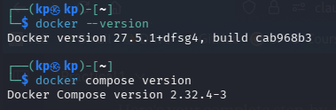

---

### 2.2 Docker Compose Configuration

A `docker-compose.yml` file was created in the project directory defining three services: redis (port 6379), mongodb (port 27017), and cassandra (port 9042). Each service used named volumes for data persistence. All three containers were started simultaneously with:

```bash
docker compose up -d
docker compose ps
```

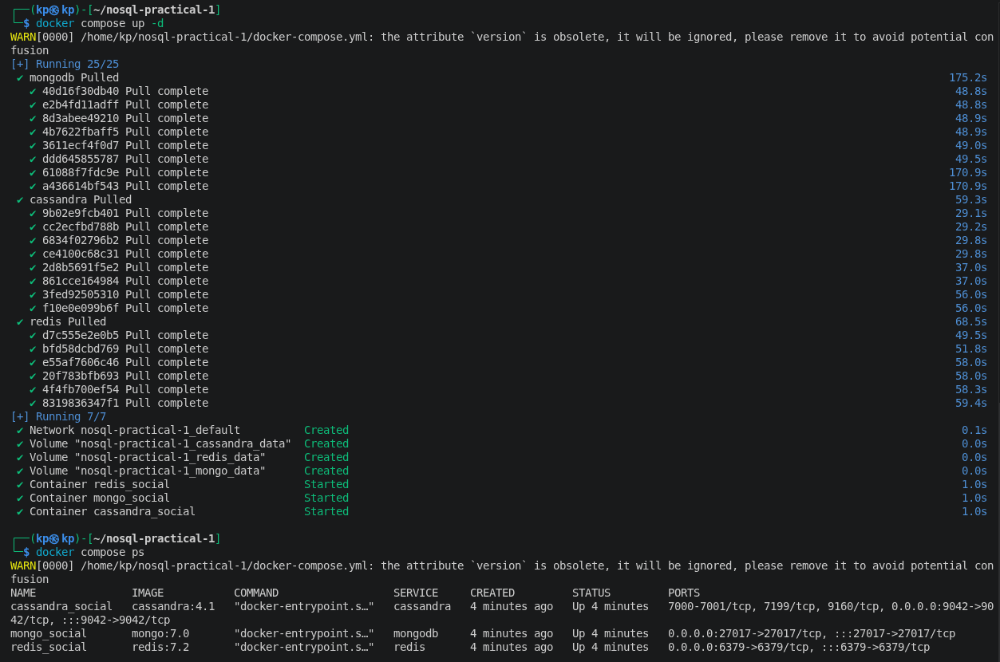

The warning regarding the obsolete `version` attribute in `docker-compose.yml` is cosmetic only - it does not affect container operation. Docker Compose v2 no longer requires the version key.

---

## 3. Part A - Redis Implementation

### 3.1 Connection

Redis was accessed via `redis-cli` inside the running container:

```bash
docker exec -it redis_social redis-cli
```

Connection was verified with the `PING` command, which returned `PONG`, confirming the server was operational.

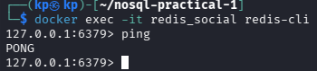

---

### 3.2 User Profiles - Hash Data Structure

Each user was stored as a Redis Hash under a namespaced key `user:{id}`. The Hash data type maps field names to values, making it well-suited to representing structured objects. Three users were created: alice (1001), bob (1002), and carol (1003).

```redis
HSET user:1001 username "alice" name "Alice Johnson" bio "Software engineer and coffee lover." joined "2024-01-15" followers_count 0 following_count 0

HSET user:1002 username "bob" name "Bob Smith" bio "Tech enthusiast and open-source contributor." joined "2024-02-20" followers_count 0 following_count 0

HSET user:1003 username "carol" name "Carol Williams" bio "Designer and digital artist." joined "2024-03-10" followers_count 0 following_count 0
```

The `HGETALL` command retrieved all fields for a given user in a single round trip:

```redis
HGETALL user:1001
```

**Output:**
```
 1) "username"
 2) "alice"
 3) "name"
 4) "Alice Johnson"
 5) "bio"
 6) "Software engineer and coffee lover."
 7) "joined"
 8) "2024-01-15"
 9) "followers_count"
10) "0"
11) "following_count"
12) "0"
```

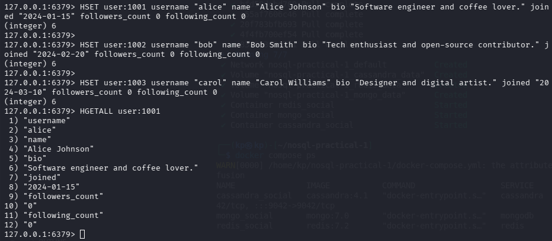

---

### 3.3 Follower Relationships - Set Data Structure

Follower and following relationships were modelled using Redis Sets. Sets provide O(1) membership testing and set-algebra operations (intersection, union, difference), which map naturally onto social graph queries.

```redis
SADD following:1001 1002 1003
SADD followers:1002 1001
SADD followers:1003 1001
SADD following:1002 1003
SADD followers:1003 1002
```

The following queries were demonstrated:

```redis
SMEMBERS following:1001
SISMEMBER following:1001 1002
SINTERSTORE mutual:1001:1002 following:1001 following:1002
SMEMBERS mutual:1001:1002
HINCRBY user:1001 following_count 2
HINCRBY user:1002 followers_count 1
HINCRBY user:1003 followers_count 2
```

**Results:**
- `SMEMBERS following:1001` → `{1002, 1003}` - Alice follows Bob and Carol.
- `SISMEMBER following:1001 1002` → `1` (true) - Alice follows Bob.
- `SINTERSTORE mutual:1001:1002` → `{1003}` - Carol is a mutual contact of Alice and Bob.

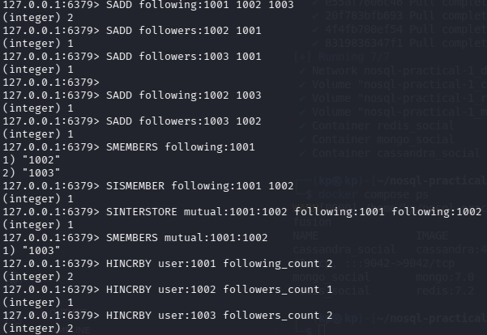

---

### 3.4 Posts and Timelines - Hash and List

Post data was stored as individual Hashes (`post:{id}`). User timelines were modelled as Redis Lists using `LPUSH`, which inserts at the head, keeping the most recent post at index 0.

```redis
HSET post:p001 user_id 1001 content "Just set up my NoSQL development environment. Redis is incredibly fast!" timestamp "2025-05-01T10:00:00Z" likes 0

HSET post:p002 user_id 1001 content "MongoDB's document model makes data modeling so intuitive." timestamp "2025-05-01T11:30:00Z" likes 0

HSET post:p003 user_id 1002 content "Learning about CAP theorem today. Fascinating trade-offs in distributed systems." timestamp "2025-05-01T09:00:00Z" likes 0

LPUSH timeline:1001 p001 p002
LPUSH timeline:1002 p003

LRANGE timeline:1001 0 9
```

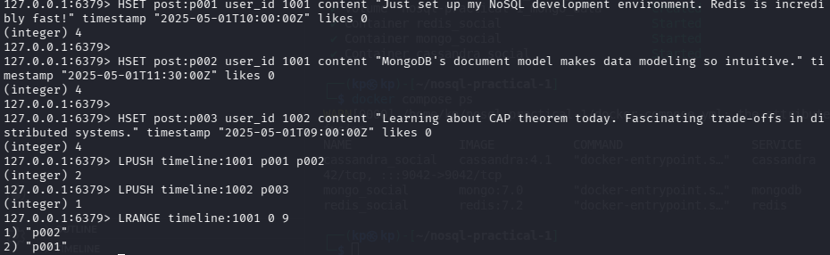

---

### 3.5 News Feed and Like Counter - Sorted Set and String

Carol's news feed was stored as a Sorted Set (`ZADD feed:1003`), using Unix timestamps as scores to enable chronological ordering. `ZREVRANGE` retrieves posts from most recent to oldest.

```redis
ZADD feed:1003 1746345600 p001
ZADD feed:1003 1746352200 p002
ZADD feed:1003 1746338400 p003

ZREVRANGE feed:1003 0 9 WITHSCORES
```

Like counters were implemented as atomic string increments:

```redis
INCR post:p001:likes
INCR post:p001:likes
INCR post:p001:likes
GET post:p001:likes
```

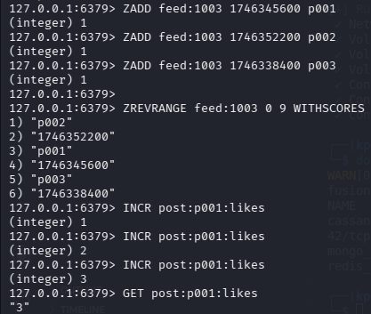

---

## 4. Part B - MongoDB Implementation

### 4.1 Connection

MongoDB was accessed via `mongosh` with admin credentials:

```bash
docker exec -it mongo_social mongosh -u admin -p password123 --authenticationDatabase admin
```

```javascript
use social_media_db
```


---

### 4.2 Document Insertion

MongoDB stores data as BSON documents within collections. Unlike Redis, a single document can contain nested sub-documents and arrays. Three user documents and four post documents were inserted using `insertMany()`.

Post documents used the **embedded design pattern**, nesting likes (an array of user IDs) and comments (an array of sub-documents) directly within each post. This eliminates the need for join tables and optimises read performance for post-centric queries.

```javascript
db.users.insertMany([
  {
    _id: "user_1001",
    username: "alice",
    name: "Alice Johnson",
    bio: "Software engineer and coffee lover.",
    joined: new Date("2024-01-15"),
    followers_count: 2,
    following_count: 1,
    following: ["user_1002", "user_1003"]
  },
  {
    _id: "user_1002",
    username: "bob",
    name: "Bob Smith",
    bio: "Tech enthusiast and open-source contributor.",
    joined: new Date("2024-02-20"),
    followers_count: 1,
    following_count: 1,
    following: ["user_1003"]
  },
  {
    _id: "user_1003",
    username: "carol",
    name: "Carol Williams",
    bio: "Designer and digital artist.",
    joined: new Date("2024-03-10"),
    followers_count: 2,
    following_count: 0,
    following: []
  }
])
```

```javascript
db.posts.insertMany([
  {
    _id: "post_p001",
    user_id: "user_1001",
    username: "alice",
    content: "Just set up my NoSQL development environment. Redis is incredibly fast!",
    created_at: new Date("2025-05-01T10:00:00Z"),
    likes: [],
    comments: [],
    tags: ["redis", "nosql", "databases"]
  },
  {
    _id: "post_p002",
    user_id: "user_1001",
    username: "alice",
    content: "MongoDB's document model makes data modeling so intuitive.",
    created_at: new Date("2025-05-01T11:30:00Z"),
    likes: ["user_1002"],
    comments: [
      {
        user_id: "user_1002",
        username: "bob",
        text: "Absolutely agree! Especially for nested data.",
        created_at: new Date("2025-05-01T12:00:00Z")
      }
    ],
    tags: ["mongodb", "nosql", "datamodeling"]
  },
  {
    _id: "post_p003",
    user_id: "user_1002",
    username: "bob",
    content: "Learning about CAP theorem today. Fascinating trade-offs in distributed systems.",
    created_at: new Date("2025-05-01T09:00:00Z"),
    likes: ["user_1001", "user_1003"],
    comments: [],
    tags: ["cap", "distributed-systems", "nosql"]
  },
  {
    _id: "post_p004",
    user_id: "user_1003",
    username: "carol",
    content: "Designed a new UI mockup for a social feed. Sharing soon!",
    created_at: new Date("2025-05-01T14:00:00Z"),
    likes: [],
    comments: [],
    tags: ["design", "ui", "ux"]
  }
])
```

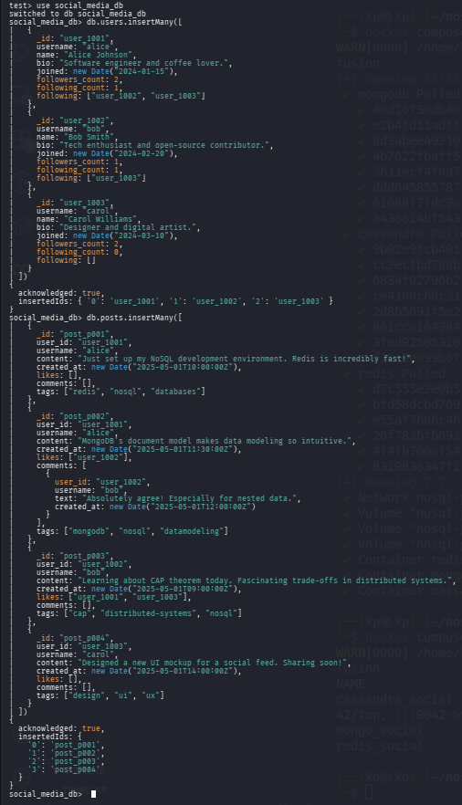

---

### 4.3 Read Queries

MongoDB's query language supports rich filtering, projection, and sorting in a single operation:

```javascript
// All posts by alice
db.posts.find({ user_id: "user_1001" }).pretty()

// Projection - content and date only
db.posts.find(
  { user_id: "user_1001" },
  { content: 1, created_at: 1, _id: 0 }
)

// Posts tagged nosql
db.posts.find({ tags: "nosql" }).pretty()

// Posts with at least one like
db.posts.find({ "likes.0": { $exists: true } })
```

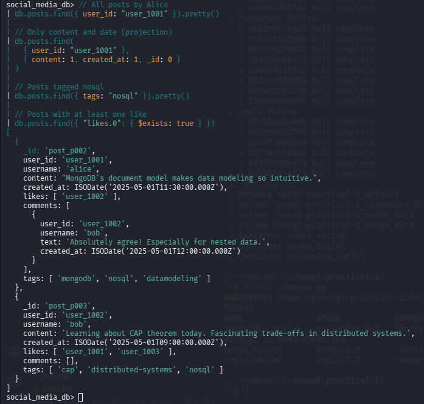

---

### 4.4 Update Operations

MongoDB's update operators modify specific fields without replacing the entire document. `$push` appended items to arrays and `$inc` incremented counters atomically:

```javascript
db.posts.updateOne(
  { _id: "post_p001" },
  {
    $push: { likes: "user_1003" },
    $inc: { likes_count: 1 }
  }
)

db.posts.updateOne(
  { _id: "post_p001" },
  {
    $push: {
      comments: {
        user_id: "user_1003",
        username: "carol",
        text: "Great setup! Which OS are you using?",
        created_at: new Date()
      }
    }
  }
)
```


---

### 4.5 Aggregation Pipeline - News Feed

The aggregation pipeline is MongoDB's most powerful feature for server-side data transformation. A four-stage pipeline was constructed to build a chronological news feed for alice:

```javascript
db.posts.aggregate([
  {
    $match: {
      user_id: { $in: ["user_1002", "user_1003"] }
    }
  },
  {
    $sort: { created_at: -1 }
  },
  {
    $limit: 10
  },
  {
    $project: {
      username: 1,
      content: 1,
      created_at: 1,
      likes_count: { $size: { $ifNull: ["$likes", []] } },
      comments_count: { $size: { $ifNull: ["$comments", []] } }
    }
  }
])
```

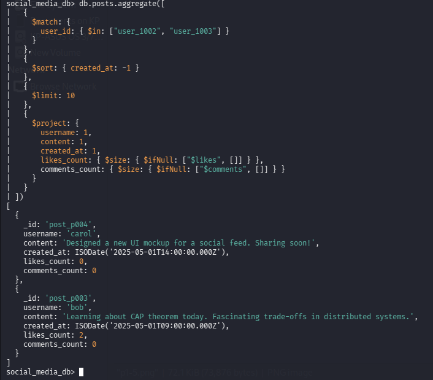

---

### 4.6 Indexes and Execution Plans

Without indexes, MongoDB performs a full collection scan (O(n)) for every query. Three indexes were created:

```javascript
db.posts.createIndex({ user_id: 1 })
db.posts.createIndex({ user_id: 1, created_at: -1 })
db.posts.createIndex({ content: "text", tags: "text" })

// Text search using the index
db.posts.find({ $text: { $search: "distributed systems" } })

// Verify indexes
db.posts.getIndexes()

// Check execution plan
db.posts.find({ user_id: "user_1001" }).explain("executionStats")
```

The `explain("executionStats")` method confirmed that subsequent queries used `IXSCAN` (index scan) rather than `COLLSCAN` (collection scan), demonstrating the performance benefit of indexing.


---

## 5. Part C - Cassandra Implementation

### 5.1 Connection

Cassandra requires approximately 60 seconds to initialise after container startup. Once ready, it was accessed via `cqlsh`:

```bash
docker exec -it cassandra_social cqlsh
```

```cql
DESCRIBE CLUSTER;
```

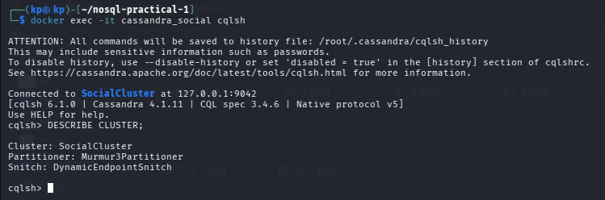

---

### 5.2 Keyspace and Table Design Philosophy

Cassandra's fundamental design principle is: **model data around queries, not around entities**. Unlike relational or document databases where tables represent real-world objects and queries navigate relationships, every Cassandra table is purpose-built for one specific access pattern.

A keyspace named `social_media` was created with `SimpleStrategy` replication (factor 1, appropriate for single-node development):

```cql
CREATE KEYSPACE IF NOT EXISTS social_media
WITH replication = {
  'class': 'SimpleStrategy',
  'replication_factor': 1
};

USE social_media;
```

Four tables were designed, each serving a distinct query:

- **users** - lookup by `user_id` (partition key).
- **posts_by_user** - retrieve all posts for a user, sorted by `created_at DESC` (clustering column).
- **followers** - retrieve all followers of a user, partitioned by `user_id`.
- **timeline_by_user** - pre-computed news feed per user, written at post-creation time (fan-out-on-write).

```cql
CREATE TABLE IF NOT EXISTS users (
    user_id   UUID,
    username  TEXT,
    name      TEXT,
    bio       TEXT,
    joined    TIMESTAMP,
    PRIMARY KEY (user_id)
);

CREATE TABLE IF NOT EXISTS posts_by_user (
    user_id     UUID,
    created_at  TIMESTAMP,
    post_id     UUID,
    username    TEXT,
    content     TEXT,
    tags        SET<TEXT>,
    likes_count INT,
    PRIMARY KEY (user_id, created_at, post_id)
) WITH CLUSTERING ORDER BY (created_at DESC, post_id ASC);

CREATE TABLE IF NOT EXISTS followers (
    user_id           UUID,
    follower_id       UUID,
    follower_username TEXT,
    followed_at       TIMESTAMP,
    PRIMARY KEY (user_id, follower_id)
);

CREATE TABLE IF NOT EXISTS timeline_by_user (
    user_id     UUID,
    created_at  TIMESTAMP,
    post_id     UUID,
    author_id   UUID,
    author_name TEXT,
    content     TEXT,
    likes_count INT,
    PRIMARY KEY (user_id, created_at, post_id)
) WITH CLUSTERING ORDER BY (created_at DESC, post_id ASC);
```

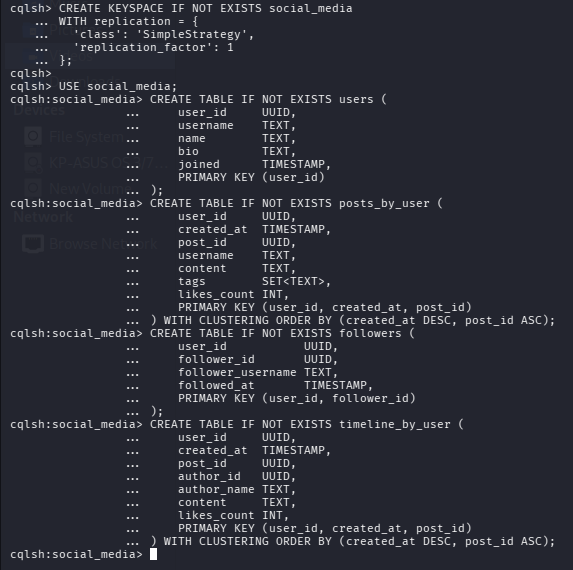

---

### 5.3 Data Insertion and Queries

Three users, three posts, two follower relationships, and two timeline entries were inserted. Alice's post was written into both Bob's and Carol's timeline tables at write time, implementing the **fan-out-on-write** pattern.

The following SELECT queries were demonstrated:

```cql
-- Alice's posts
SELECT username, content, created_at, likes_count
FROM posts_by_user
WHERE user_id = 11111111-1111-1111-1111-111111111111;

-- Alice's followers
SELECT follower_username, followed_at
FROM followers
WHERE user_id = 11111111-1111-1111-1111-111111111111;

-- Bob's news feed
SELECT author_name, content, created_at, likes_count
FROM timeline_by_user
WHERE user_id = 22222222-2222-2222-2222-222222222222
LIMIT 20;
```

**Results:**
- Alice's posts - 2 rows, sorted most-recent-first automatically by clustering order.
- Alice's followers - bob and carol with real timestamps.
- Bob's news feed - Alice's post via the pre-computed fan-out.

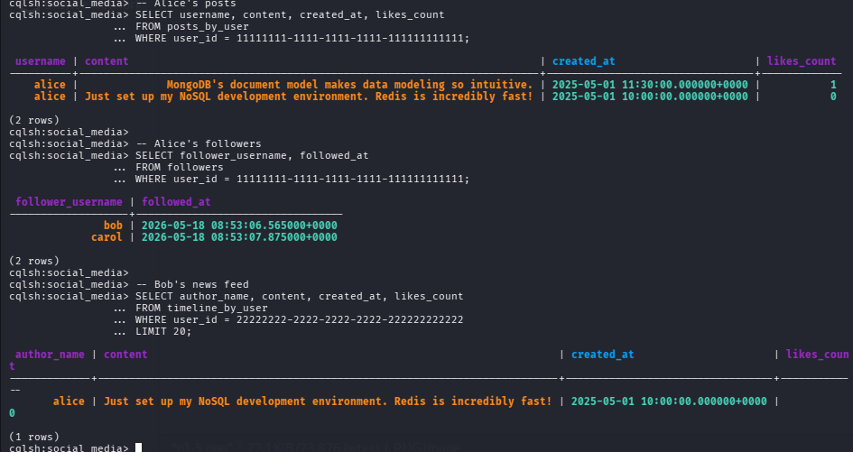

---

### 5.4 Query Tracing

Cassandra's built-in tracing feature exposes the internal execution of queries at the coordinator and storage engine level:

```cql
TRACING ON;

SELECT author_name, content, created_at
FROM timeline_by_user
WHERE user_id = 22222222-2222-2222-2222-222222222222
LIMIT 10;

TRACING OFF;
```

The trace output revealed the following execution stages:

| Stage | Elapsed |
|-------|---------|
| Execute CQL3 query received at coordinator | 0 µs |
| Parsing and preparing statement | 262–606 µs |
| Executing single-partition query | 1,416 µs |
| Acquiring sstable references | 1,634 µs |
| Merging memtable and sstable data | 2,732 µs |
| Read 1 live rows and 0 tombstone cells | 2,938 µs |
| Request complete | **3,311 µs (~3.3 ms)** |

The key observation is the phrase **executing single-partition query**, which confirms Cassandra went directly to the correct storage partition without scanning unrelated data - a hallmark of correct Cassandra data modelling.

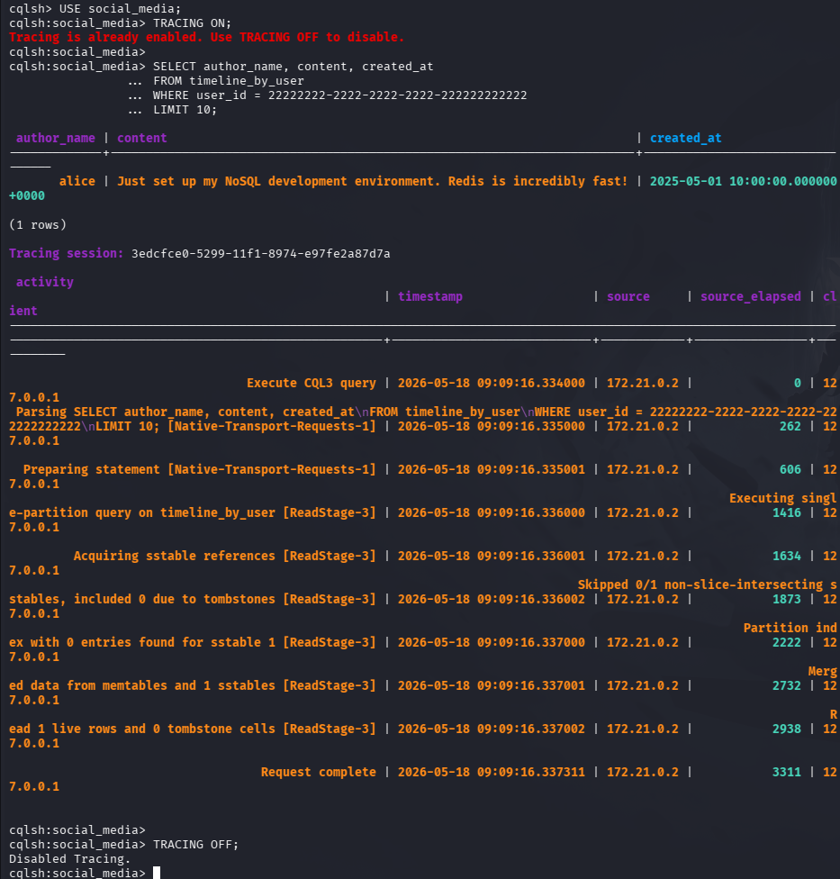

---

### 5.5 ALLOW FILTERING - Prohibited Query Pattern

Attempting to query by `username` (a non-primary-key column) produced an `InvalidRequest` error:

```cql
SELECT * FROM posts_by_user WHERE username = 'alice';
```

**Error received:**
```
InvalidRequest: Error from server: code=2200 [Invalid query] message="Cannot execute
this query as it might involve data filtering and thus may have unpredictable
performance. If you want to execute this query despite the performance
unpredictability, use ALLOW FILTERING"
```

This error demonstrates a fundamental Cassandra constraint: only partition keys and clustering columns may be used as query filters without `ALLOW FILTERING`. Using `ALLOW FILTERING` in production forces a full cluster scan and is strongly discouraged. The correct solution is to create a separate table partitioned by `username`.

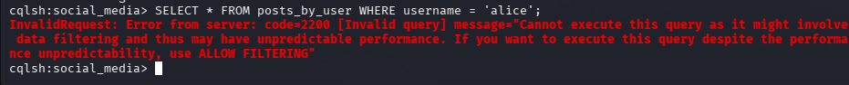

---

## 6. Python Benchmark Results

A Python benchmarking script was executed to measure write and read throughput for 500 records across all three databases. The script used the `redis`, `pymongo`, and `cassandra-driver` libraries and was run inside a Python virtual environment on Kali Linux.

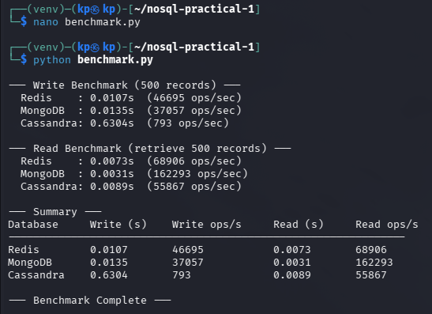

---

### 6.1 Results

| Database | Write Time (s) | Write (ops/sec) | Read Time (s) | Read (ops/sec) |
|----------|---------------|-----------------|---------------|----------------|
| Redis | 0.0107 | 46,695 | 0.0073 | 68,906 |
| MongoDB | 0.0135 | 37,057 | 0.0031 | 162,293 |
| Cassandra | 0.6304 | 793 | 0.0089 | 55,867 |

---

### 6.2 Interpretation

#### Write Performance

**Redis** achieved the highest write throughput (46,695 ops/sec) owing to its entirely in-memory operation model. All writes go directly to RAM with no disk I/O on the critical path, making it the fastest option for write-heavy workloads on a single node.

**MongoDB** performed competitively (37,057 ops/sec). On a single node with default write concern, MongoDB buffers writes before flushing to disk, producing performance approaching Redis for small datasets.

**Cassandra** recorded the lowest write throughput in this single-node setup (793 ops/sec). This result is architecturally misleading: Cassandra's write path involves a commit log and memtable flush, and its true strength emerges in multi-node clusters. In a production environment with three or more nodes, Cassandra's write throughput scales linearly with each additional node, and would comfortably surpass both Redis and MongoDB at scale.

#### Read Performance

**MongoDB** produced the highest read throughput (162,293 ops/sec). With a compound index on `(user_id, created_at)`, retrieving all 500 documents matching a single `user_id` becomes a single efficient index scan - an extremely favourable access pattern.

**Redis** achieved 68,906 ops/sec for reads. However, the Redis read benchmark required two steps: first fetching post IDs from a List (`LRANGE`), then issuing a pipelined batch of `HGETALL` commands. This two-step process introduces additional overhead compared to MongoDB's single indexed scan.

**Cassandra** read at 55,867 ops/sec. A single partition scan retrieved all 500 records in one operation, with consistent and predictable latency regardless of dataset size - a key property for production SLA guarantees.

---

## 7. Exercises

### Exercise 1 - Redis: Trending Hashtags

A Redis Sorted Set was used to model trending hashtags. The score represents the number of posts using that hashtag. Five hashtags were inserted with varying scores:

```redis
ZADD trending:hashtags 150 "nosql"
ZADD trending:hashtags 200 "redis"
ZADD trending:hashtags 85  "mongodb"
ZADD trending:hashtags 310 "databases"
ZADD trending:hashtags 60  "cassandra"
```

The top three trending hashtags were retrieved using `ZREVRANGE`, which returns members ordered from highest to lowest score:

```redis
ZREVRANGE trending:hashtags 0 2 WITHSCORES
```

**Output:**
```
1) "databases"
2) "310"
3) "redis"
4) "200"
5) "nosql"
6) "150"
```

**Result:** databases (310) → redis (200) → nosql (150). The Sorted Set provided O(log N) insertion and O(log N + M) range retrieval, making it ideal for real-time leaderboards and trending feeds.

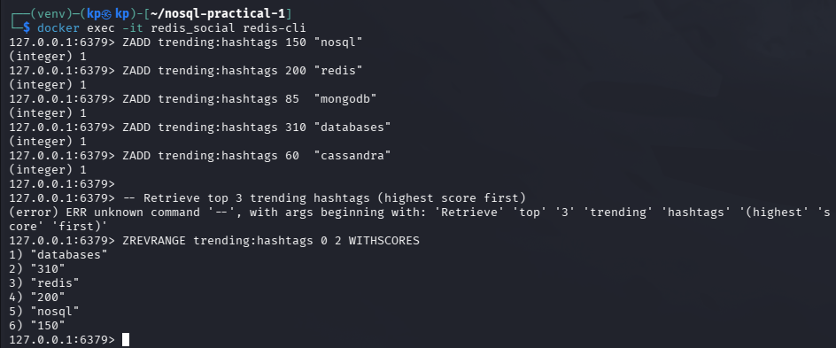

---

### Exercise 2 - MongoDB: Top 5 Most-Liked Posts with $lookup

An aggregation pipeline was constructed to find the five most-liked posts and enrich them with author information from the users collection. The pipeline used four stages:

- `$addFields` - computed `likes_total` as the size of the likes array.
- `$sort` - ordered results by `likes_total` descending.
- `$limit` - restricted output to 5 documents.
- `$lookup` - joined the users collection on `user_id` to retrieve the author's full name.

```javascript
db.posts.aggregate([
  {
    $addFields: {
      likes_total: { $size: { $ifNull: ["$likes", []] } }
    }
  },
  {
    $sort: { likes_total: -1 }
  },
  {
    $limit: 5
  },
  {
    $lookup: {
      from: "users",
      localField: "user_id",
      foreignField: "_id",
      as: "author_info"
    }
  },
  {
    $project: {
      content: 1,
      likes_total: 1,
      username: 1,
      "author_info.name": 1
    }
  }
])
```

**Output:**
```json
[
  { "_id": "post_p003", "username": "bob",   "likes_total": 2, "author_info": [{ "name": "Bob Smith" }],   "content": "Learning about CAP theorem..." },
  { "_id": "post_p001", "username": "alice", "likes_total": 1, "author_info": [{ "name": "Alice Johnson" }], "content": "Just set up my NoSQL..." },
  { "_id": "post_p002", "username": "alice", "likes_total": 1, "author_info": [{ "name": "Alice Johnson" }], "content": "MongoDB's document model..." },
  { "_id": "post_p004", "username": "carol", "likes_total": 0, "author_info": [{ "name": "Carol Williams" }], "content": "Designed a new UI mockup..." }
]
```

Bob's CAP theorem post ranked first with 2 likes. The `$lookup` join operated server-side without requiring a second query, demonstrating MongoDB's capability for relational-style operations.

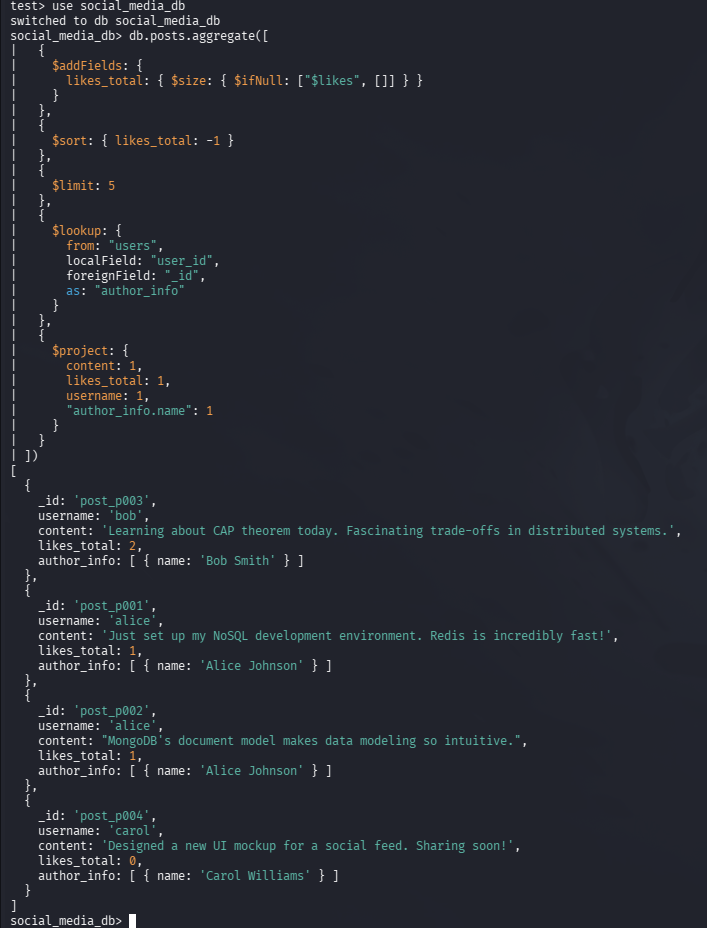

---

### Exercise 3 - Cassandra: posts_by_tag Table

A new table `posts_by_tag` was designed to answer the query: *retrieve all posts with a given tag, sorted by creation time, most recent first*. The `tag` column serves as the partition key; `created_at` and `post_id` are clustering columns with DESC ordering:

```cql
CREATE TABLE IF NOT EXISTS posts_by_tag (
    tag        TEXT,
    created_at TIMESTAMP,
    post_id    UUID,
    user_id    UUID,
    username   TEXT,
    content    TEXT,
    PRIMARY KEY (tag, created_at, post_id)
) WITH CLUSTERING ORDER BY (created_at DESC, post_id ASC);
```

Five posts were inserted with two overlapping tags (`nosql` and `databases`):

```cql
INSERT INTO posts_by_tag (tag, created_at, post_id, user_id, username, content)
VALUES ('nosql', '2025-05-01 09:00:00+0000', uuid(), 22222222-2222-2222-2222-222222222222, 'bob', 'CAP theorem and distributed systems.');

INSERT INTO posts_by_tag (tag, created_at, post_id, user_id, username, content)
VALUES ('nosql', '2025-05-01 10:00:00+0000', uuid(), 11111111-1111-1111-1111-111111111111, 'alice', 'Redis is incredibly fast!');

INSERT INTO posts_by_tag (tag, created_at, post_id, user_id, username, content)
VALUES ('nosql', '2025-05-01 11:30:00+0000', uuid(), 11111111-1111-1111-1111-111111111111, 'alice', 'MongoDB document model is intuitive.');

INSERT INTO posts_by_tag (tag, created_at, post_id, user_id, username, content)
VALUES ('databases', '2025-05-01 08:00:00+0000', uuid(), 33333333-3333-3333-3333-333333333333, 'carol', 'Comparing NoSQL options today.');

INSERT INTO posts_by_tag (tag, created_at, post_id, user_id, username, content)
VALUES ('databases', '2025-05-01 13:00:00+0000', uuid(), 22222222-2222-2222-2222-222222222222, 'bob', 'Cassandra scales linearly - impressive!');
```

Tag-based retrieval query:

```cql
SELECT username, content, created_at
FROM posts_by_tag
WHERE tag = 'nosql';
```

**Output:**
```
 username | content                              | created_at
----------+--------------------------------------+---------------------------------
    alice | MongoDB document model is intuitive. | 2025-05-01 11:30:00.000000+0000
    alice |            Redis is incredibly fast! | 2025-05-01 10:00:00.000000+0000
      bob | CAP theorem and distributed systems. | 2025-05-01 09:00:00.000000+0000
(3 rows)
```

Three rows returned for the `nosql` tag, ordered 11:30 → 10:00 → 09:00. The clustering order applied automatically with no additional `ORDER BY` needed at query time.

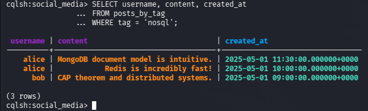

---

### Exercise 4 - Comparison: Impact of a Username Change

When a user changes their username, the update cost differs significantly across the three databases:

| Database | What Must Be Updated | Effort |
|----------|----------------------|--------|
| **Redis** | `HSET user:{id} username "newname"` on the user Hash. Additionally, every post Hash and any field that stored the username as a denormalised value must be updated individually. | Medium - multiple key updates; no referential integrity enforced |
| **MongoDB** | `updateMany` on the posts collection to change the embedded `username` field. All embedded comment sub-documents containing the username must also be updated using `$set` with array filters. | Medium - single `updateMany` can batch all changes; atomic at document level |
| **Cassandra** | Every row in `posts_by_user`, `timeline_by_user`, `followers`, and `posts_by_tag` that stores `username` as a column must be updated. In Cassandra, updating a clustering column requires deleting the old row and inserting a new one. | High - data duplication across many tables means many writes; no cascade support |

**Key lesson:** The degree of denormalisation determines the cost of mutable fields. Cassandra's query-driven schema duplicates data across many tables, making mutable columns expensive to update. This is why in production Cassandra systems, frequently-changed fields are either avoided as primary key components or managed through an application-layer fan-out update process. This trade-off highlights a core design principle: databases that optimise for read speed through pre-computation impose a higher write cost for data mutations.

---

## 8. Comparison Table

| Aspect | Redis | MongoDB | Cassandra |
|--------|-------|---------|-----------|
| **Data model** | Key-value / Hash / List / Set / Sorted Set | BSON document collections | Partitioned rows with clustering columns |
| **Schema** | None enforced | Optional validator rules | Strict DDL required |
| **Query for user posts** | `LRANGE timeline:{id} 0 9` (IDs only; second trip for content) | `db.posts.find({ user_id:... }).sort({ created_at:-1 }).limit(10)` | `SELECT * FROM posts_by_user WHERE user_id = ? LIMIT 10` |
| **Relationships** | Manual via separate keys | Embedding or `$lookup` referencing | Denormalisation (data duplication) |
| **Aggregation** | Not supported natively; client-side logic required | Powerful pipeline (`$match`, `$sort`, `$lookup`, `$project`) | Not supported; data pre-aggregated at write time |
| **Write throughput (500 records)** | 46,695 ops/sec | 37,057 ops/sec | 793 ops/sec (single node; scales linearly with nodes) |
| **Read throughput (500 records)** | 68,906 ops/sec | 162,293 ops/sec (with index) | 55,867 ops/sec (single partition scan) |
| **Persistence** | Optional (RDB / AOF snapshots) | Always on disk (WiredTiger) | Always on disk (LSM tree / SSTables) |
| **Horizontal scale** | Redis Cluster (hash slots) | Sharding with mongos router | Linear - add nodes, increase throughput proportionally |
| **Ad-hoc queries** | Very limited | Excellent - any field queryable with index | Very limited - partition key required |
| **Best use case** | Caching, sessions, real-time counters, leaderboards | Flexible schemas, analytics, content management | High-volume writes, pre-computed timelines, IoT event streams |

---

## 9. Summary Analysis

### 9.1 Key Lessons Learned

This practical reinforced that NoSQL is not a single technology but a family of systems, each making deliberate trade-offs to excel in specific scenarios. Three key lessons stand out:

**Lesson 1: Schema design philosophy determines everything.**
Redis has no schema - the developer is entirely responsible for naming conventions and data integrity. MongoDB offers optional schema validation but defaults to flexibility. Cassandra enforces a strict DDL schema, and that schema encodes the application's query plan. Choosing the wrong approach for a given system leads either to inconsistent data (Redis/MongoDB without discipline) or unmaintainable tables (Cassandra without query-first thinking).

**Lesson 2: Read optimisation always comes at a write cost.**
Cassandra's fan-out-on-write pattern - duplicating Alice's post into every follower's timeline at write time - makes reads extremely fast (a single partition scan with no joins). However, it means a post with 10,000 followers requires 10,000 write operations. Redis and MongoDB take a lighter write approach but require more complex read logic to assemble feeds. There is no free lunch: every design choice shifts work between reads and writes.

**Lesson 3: Benchmarks on a single node are misleading for Cassandra.**
Cassandra's 793 write ops/sec on a single local node dramatically understates its production capability. Its architecture - using a commit log (sequential write) and in-memory memtable - is specifically designed to sustain millions of writes per second across a cluster. The benchmark confirms Redis is fastest for small single-node write workloads, but this relationship reverses at scale.

---

### 9.2 Database Selection for a Real Social Media Platform

If selecting a database for a real social media platform, no single database is the right answer. A production system would use all three in combination, each serving its area of strength:

| Layer | Database | Rationale |
|-------|----------|-----------|
| Session storage & auth tokens | Redis | Sub-millisecond reads, automatic TTL expiry, no disk overhead |
| Feed cache (hot users) | Redis Sorted Set | Pre-computed feeds for high-traffic accounts served from memory |
| User profiles & search | MongoDB | Flexible schema accommodates profile variations; text index enables search |
| Post storage & timelines | Cassandra | Write-heavy workload; fan-out-on-write delivers O(1) feed reads at any scale |
| Analytics & reporting | MongoDB | Aggregation pipeline supports complex queries without a separate analytics DB |

If forced to choose a single database, **MongoDB** would be the most pragmatic choice for a startup-scale social platform. Its flexible document model accommodates rapid iteration without schema migrations; its aggregation pipeline covers most analytics needs; and its horizontal sharding provides a clear growth path. Redis would be added immediately as a caching layer, and Cassandra would be introduced once write volume exceeds what MongoDB can sustain cost-effectively at scale.

This practical has demonstrated that understanding the data model, query patterns, and consistency trade-offs of each NoSQL category is essential for making informed architectural decisions - there is no universally correct choice, only the right choice for a given workload.

---
